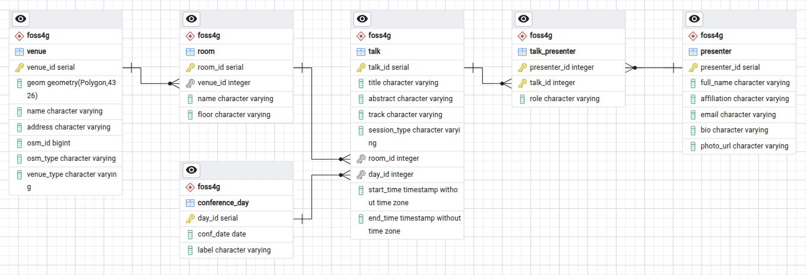
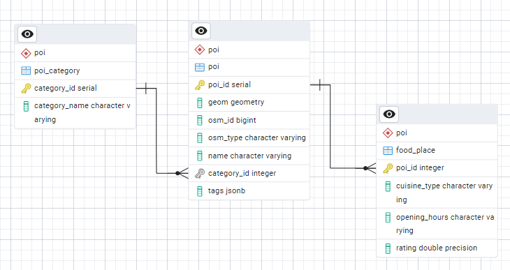
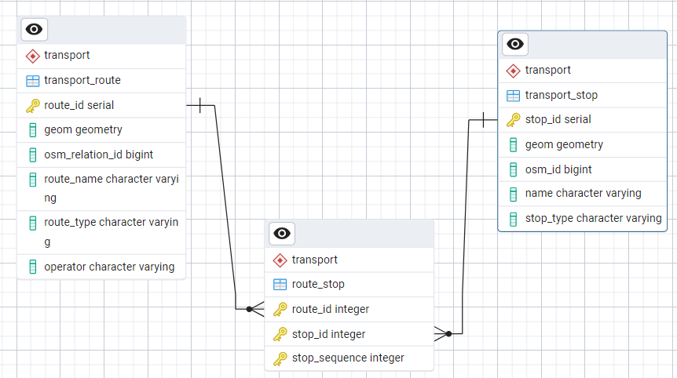

# Discovering PostGIS: An Introduction for QGIS Users

**Presented at FOSS4G Hiroshima 2026 by [John Bryant](https://www.linkedin.com/in/john-wesley-bryant/) and [Federica Gaspari](https://www.linkedin.com/in/federicagaspari/)**


#### Data Credits

- Map data © [OpenStreetMap](https://www.openstreetmap.org/copyright) contributors, available under the [Open Database License (ODbL)](https://opendatacommons.org/licenses/odbl/)
- OSM extracts provided by [Geofabrik](https://download.geofabrik.de/)
- [Natural Earth](https://www.naturalearthdata.com/) — free vector and raster map data, public domain

## Connecting to PostGIS
Before we can do much else, we need to create a connection to our PostGIS database. We'll look at three ways to do this in the QGIS Browser panel:

### Store user credentials in the connection as plain text
- Create a New PostgreSQL Connection
    - Add Connection Details (hostname, database, username & password)
    - Add Database Details
        - "Also list tables with no geometry"
        - "Use estimated table metadata"
    - Basic Authentication
        - Use your own username & password; check "Store" to make them persistent
- "Test Connection" to confirm it works
- Add a layer eg `poi`, look at connection credentials
- Export a qlr and look at the xml in a text editor - contains credentials in plain text
- Pros: quick and easy
- Cons: password is embedded and visible to other users - bad for sharing

### Use a QGIS Authentication Configuration
- Save user credentials to an auth config
- All users sharing this project/layer must have a similar config id
- Pros: can share layers and projects without sharing credentials
- Cons: config must share same id, can be difficult to manage across users and devices

### Use a `pg_service.conf` file
- Use a config file in your home directory
- Create a file called `pg_service.conf` on Windows, `.pg_service.conf` on Linux & Mac (*note the `.` at the beginning of the filename*)
- Add a named "service" called `foss4g_workshop_user`:
``` ini
[foss4g_workshop_user]
host=foss4g-workshop.mammothgeospatial.com
port=5432
dbname=foss4g_workshop
user=<your username>
password=<your password>
```
- On Windows? Add an environment variable:
``` ps1
setx PGSERVICEFILE "%userprofile%\pg_service.conf"
```
- On Windows, restart QGIS before continuing
- In QGIS, add a new connection w/ reference to service name
- Pros: easy to manage changes to credentials, better interoperability across users/environments/applications
- Cleanup: remove all but one of these connections

### Schemas
- What are they? Used for organising DB objects and managing security on groups of objects
- Look at existing ones in db: `foss4g`, `naturalearth`, `poi`, `public`, `transport`
- What is `public` schema?
    - default namespace automatically created inside every new database
    - if no schema is specified, `public` is implicit
    - contains some PostGIS stuff (functions, operators, data types, and some key tables & views)

### Load layers
- Preview & load layers from Browser Panel

## Relations, Privileges, Edit POIs

### Relations
- Concept of relations
- Load all the tables from `foss4g` schema
- In PostGIS, the tables are related:



- In QGIS, Project Properties -> Discover Relations
- Look at feature form

### Users/roles/privileges
- Concept: permissions on schemas & tables
- Load `poi` layer to QGIS, note that it's not editable
- Why can we *load* this layer but not *edit* it? Because we're a member of `foss4g_viewer`, which has read-only privileges
- Grant edit permission and load the layer again - can edit
``` sql
grant insert, update on poi.poi to foss4g_viewer;
```
- Revoke it (let's do this properly!)
``` sql
revoke insert, update on poi.poi from foss4g_viewer;
```
- Create `foss4g_editor` role, grant permission, add users
``` sql
create role foss4g_editor;
grant select, insert, update on poi.poi to foss4g_editor;
grant all on sequence poi.poi_poi_id_seq to foss4g_editor;
grant foss4g_editor to username; -- run this line for each user
```

#### Editing POIs
- Load `poi`, make it editable, add a point. Notice that `category_id` is an integer input. Cancel edit.
- Load `poi_category`
- Project Properties -> Discover Relations



- Try again - now there is a dropdown with meaningful info from the relation.


## Load to PostGIS, Create Query Layers, Create Views

### Create user schemas
We need a place where you can load data - we'll create a schema for each user, where they have read/write privileges.
- Create user schemas & grant permissions
``` sql
create schema if not exists u_username;
grant all on schema u_username to username with grant option;
alter default privileges in schema u_username grant all on tables to username;
alter default privileges in schema u_username grant all on sequences to username;
```
- If you want, you can grant privileges to other users on your own schema
``` sql
grant usage on schema u_username to anotheruser;
grant select on all tables in schema u_username to anotheruser;
alter default privileges in schema u_username grant select on tables to anotheruser;
```

### Load data to your schema
Now we have a place with appropriate permissions, we can import data into PostGIS.

**IMPORTANT**: with several people doing this at the same time, we may quickly tie up the database server's resources. We'll use relatively small datasets to keep it quick & (hopefully) painless.

We'll load some OpenStreetMap data extracted from easy-access downloads provided by [Geofabrik](https://www.geofabrik.de/data/download.html).

Download the data [here](https://github.com/mammothgeospatial/workshop-postgis-foss4g-2026/raw/refs/heads/main/data/osm_data_geofabrik.gpkg).

Two ways:
- In the QGIS Browser panel, right-click -> `Import Vector Layer` or simply drag & drop.
- You can also load data with a geoprocessing tool: `Export to PostgreSQL (existing connection)`

### Create Query Layers in QGIS using SQL
You can execute SQL queries in QGIS and load the results as a "Query Layer". We'll walk through some examples to get a feel for what's possible using this method.

##### Populated Places in Japan
``` sql
select *
from naturalearth.ne_10m_populated_places
where "ADM0NAME" = 'Japan';
```

##### Large Cities in Japan
``` sql
select *
from naturalearth.ne_10m_populated_places
where "POP_MAX" > 1000000 and "ADM0NAME" = 'Japan';
```

##### Japanese Admin Areas
We can add additional columns, like area:
``` sql
select fid, name, round(st_area(geom::geography)/1000000) as area_km2, geom
from naturalearth.ne_10m_admin_1_states_provinces
where admin = 'Japan'
order by name;
```

##### Japanese Airports
The airports layer doesn't have a country field to filter with, but we can use its geometry:
``` sql
select *
from naturalearth.ne_10m_airports
where
    st_within(
        geom,
        (select geom from naturalearth.ne_10m_admin_0_countries where "ADMIN" = 'Japan')
    );
```

##### Areas Within 100km of Japanese Airports
We can derive new geometries by buffering, transforming, merging, etc:
``` sql
select
	1 as id,
	st_union(st_buffer(st_transform(geom, 32654), 100000)) as geom
from naturalearth.ne_10m_airports
where
    st_within(
        geom,
        (select geom from naturalearth.ne_10m_admin_0_countries where "ADMIN" = 'Japan')
    );
```

##### Okonomiyaki restaurants within 2km of the workshop venue
``` sql
with venue as (
    select geom::geography as geog
    from foss4g.venue
    where name = 'RCC Bunka Center'
)
select
    poi.*,
    st_distance(poi.geom::geography, venue.geog) as distance
from poi.poi poi, venue
where poi.name ilike '%Okonomiyaki%'
  and st_dwithin(poi.geom::geography, venue.geog, 2000)
order by distance;
```

##### Closest streetcar stops from the venue locations and related euclidean distances

Simple solution leveraging *CROSS JOIN* operator.

``` sql
SELECT
    v.name AS venue,
    s.name AS boarding_stop,
    s.geom AS boarding_point,
    ST_ShortestLine(v.geom, s.geom) AS distance_to_stop,
    ST_Length(ST_Transform(ST_ShortestLine(v.geom, s.geom), 6691)) AS distance_length_m
FROM foss4g.venue v
CROSS JOIN LATERAL (
    SELECT name, geom
    FROM transport.transport_stop
    ORDER BY geom <-> v.geom
    LIMIT 1
) s;
```

More detailed solution combines also routes connected to each stop, leveraging many-to-many relation between transport stops and routes.



``` sql
WITH nearest_stop AS (
    SELECT
        v.name AS venue,
        s.stop_id,
        s.name AS boarding_stop,
        s.geom AS boarding_point,
        ST_ShortestLine(v.geom, s.geom) AS walk_to_stop
    FROM foss4g.venue v
    CROSS JOIN LATERAL (
        SELECT stop_id, name, geom
        FROM transport.transport_stop
        ORDER BY geom <-> v.geom
        LIMIT 1
    ) s
)
SELECT
    ns.venue,
    ns.boarding_stop,
    ns.boarding_point,
    ns.walk_to_stop,
    ST_Length(ST_Transform(ns.walk_to_stop, 6691)) AS distance_length_m,
    string_agg(DISTINCT tr.route_name, ', ' ORDER BY tr.route_name) AS served_by_routes
FROM nearest_stop ns
JOIN transport.route_stop rs ON rs.stop_id = ns.stop_id
JOIN transport.transport_route tr ON tr.route_id = rs.route_id
GROUP BY ns.venue, ns.boarding_stop, ns.boarding_point, ns.walk_to_stop;
```

### Create Views in PostGIS
- One simple way: add a line to the beginning of your select query, ie:
``` sql
create view schemaname.viewname as
...
```
